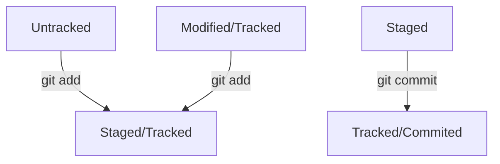

# H1 Заголовки
## H2 бывают
### H3 разных
#### H4 зазмеров
##### H5 и 
###### H6 величин
 
 
### Выделение 
текст может быть купсивом, если заключён в *звёздочки* '*' или нижние_ подчёркивания_ '_',
или полужирным, если  **две зведы** "**" или __два подчёркивания__ "__",
для зачёркнутого ~~ставят ~~ "~~" 
а **ещё их ~~можно~~ __комбинировать__**
 
 
[для создания ссылок]("https://github.com/ne6esisbka/SOS_Bot/blob/master/readme.md") используют"[]->__для текста__ ()->__для ссылки__"
 
 
Новые обзацы отделяются 2<Enter> пропуская 2 строки
 
Это начало

### ХЕШ -- идентификатор коммита

В процессе работы с Git вам будет часто встречаться понятие «хеш коммита».
Эти странные строчки с бессмысленным (на первый взгляд) набором букв и цифр вы могли видеть,
когда вызывали команду git log и выводили историю коммитов.

В этом уроке разберём, что такое хеши и зачем они нужны.
Что такое хеш. Хеширование коммитов

Хеширование (от англ. hash, «рубить», «крошить», «мешанина») — это способ преобразовать набор данных и получить их «отпечаток» (англ. fingerprint).
   
Информация о коммите — это набор данных: когда был сделан коммит, содержимое файлов в репозитории 
на момент коммита и ссылка на предыдущий, или родительский (англ. parent), коммит.
Git хеширует (преобразует) информацию о коммите с помощью алгоритма SHA-1 (от англ. Secure Hash Algorithm — 
«безопасный алгоритм хеширования») и получает для каждого коммита свой уникальный хеш — результат хеширования.
Обычно хеш — это короткая (40 символов в случае SHA-1) строка, которая состоит из цифр от 0—9 и латинских букв A—F 
(неважно, заглавных или строчных). Она обладает следующими важными свойствами:
если хеш получить дважды для одного и того же набора входных данных, то результат будет гарантированно одинаковый;
если хоть что-то в исходных данных поменяется (хотя бы один символ), то хеш тоже изменится (причём сильно).
  
 Чтобы убедиться в этом, можно поэкспериментировать с SHA-1 на этом сайте — попробуйте ввести 
в поле input (англ. «ввод») разные символы, слова или предложения и понаблюдайте, как меняется хеш в поле output (англ. «вывод»).
   
Хеш — основной идентификатор коммита
Git хранит таблицу соответствий хеш → информация о коммите. Если вы знаете хеш, вы можете узнать всё остальное: 
автора и дату коммита и содержимое закоммиченных файлов. Можно сказать, что хеш — основной идентификатор коммита.

При работе с Git хеши будут встречаться вам регулярно. Их можно будет передавать в качестве параметра разным 
Git-командам, чтобы указать, с каким коммитом нужно произвести то или иное действие.
Все хеши и таблицу хеш → информация о коммите Git сохраняет в служебные файлы. Они находятся в скрытой папке .git в репозитории проекта.

 
 
### HEAD -- это голова.

Это новый обзац
но эта строка составная часть обзаца
 
 
Файл HEAD (англ. «голова», «головной») — один из служебных файлов папки .git. Он указывает на коммит, который сделан последним (то есть на самый новый).
В этом можно убедиться с помощью терминала. Перейдите в папку .git командой cd. Посмотрите содержимое файла HEAD командой cat.

$ pwd # посмотрели, где мы
/Users/user/dev/first-project

$ cd .git/
$ ls # посмотрели, какие есть файлы
COMMIT_EDITMSG  ORIG_HEAD  description  index  logs/     refs/
HEAD            config     hooks/       info/  objects/

$ cat HEAD # команда cat показывает содержимое файла
ref: refs/heads/master # в файле вот такая ссылка 

Внутри HEAD — ссылка на служебный файл: refs/heads/master (или refs/heads/main в зависимости от названия ветки). Если заглянуть в этот файл, можно увидеть хеш последнего коммита.

$ cat refs/heads/master # взяли ссылку из файла HEAD
"# внутри хеш
e007f5035f113f9abca78fe2149c593959da5eb7

$ git log 
"# сверяем с хешем последнего коммита
commit e007f5035f113f9abca78fe2149c593959da5eb7
Author: John Doe <johndoe@example.com>
Date:   Tue Mar 28 00:26:53 2023 +0300

    Добавить амбиций в список дел

... # другие коммиты 

Когда вы делаете коммит, Git обновляет refs/heads/master — записывает в него хеш последнего коммита.
Получается, что HEAD тоже обновляется, так как ссылается на refs/heads/master.

При работе с Git указатель HEAD используется довольно часто.
 Мы уже упоминали, что многие команды Git принимают в качестве параметра хеш коммита. 
Если нужно передать последний коммит, то вместо его хеша можно просто написать слово HEAD — Git поймёт, что вы имели в виду последний коммит.

### Коммит -- это всему голова

Коммит — это одна из основных сущностей в Git (и в других системах контроля версий). 
Коммит гарантирует, что изменения будут сохранены в истории и при необходимости к ним можно будет «откатиться».
Это как если бы вы могли выполнить операцию Ctrl+Z для целой папки (репозитория).
В этом уроке вы сделаете свой первый коммит.
Выполнить коммит — **git commit**
Сделать коммит можно командой git commit c ключом -m (от англ. message — «сообщение»), 
который присваивает коммиту сообщение.
Обычно в таком сообщении поясняется, в чём именно состояли изменения. Это как заметки на полях: благодаря им проще читать и понимать текст. 
Сообщение коммита выполняет те же функции — улучшает понимание и упрощает навигацию. 
Оно пишется после ключа -m в кавычках.

Например, перейдите в папку first-project и выполните коммит со следующим комментарием.

$ git commit -m 'Мой первый коммит!' 

После нажатия Enter текущая версия файлов будет сохранена в репозитории с сообщением Мой первый коммит!. 
Коммит (по названию команды git commit) — это по сути список файлов с их контентом.

Команда git commit выведет информацию о коммите.

*[master (root-commit) baa3b6e]* значит:
коммит был в ветке master;
*root-commit* — это самый первый, или «корневой» (англ. root), коммит в ветке, у следующих коммитов такой надписи не будет;
baa3b6e — сокращённый идентификатор коммита (подробнее об этом мы ещё расскажем).
2 files changed, 1 insertion(+) значит:
изменились два файла (readme.txt и todo.txt);
одна строка была добавлена (1. Пройти пару уроков по Git.).
Строки вида create mode 100644 readme.txt — это более подробная информация о новых (добавленных в Git) файлах.
create (англ. «создать») говорит, что файл был создан. Если бы файл был удалён, на этом месте было бы слово delete (англ. «удалить»).
mode 100644 сообщает, что это обычный файл. Также возможны варианты 100755 для исполняемых файлов (например, что-нибудь.exe) и 120000 для файлов-ссылок в Linux. 
Файлы-ссылки не содержат данных сами по себе, а только ссылаются на другие файлы — как «ярлыки» в Windows.
💡Обратите внимание: после того как вы сделали первый коммит, команда git status перестала выводить сообщение No commits yet (англ. «ещё нет коммитов»).
Ещё раз о разнице между git add и git commit
Сначала команда git add сообщает Git, какие именно файлы нужно сохранить и какую их версию. Затем с помощью команды git commit происходит само сохранение. 
В прошлом уроке мы сравнили add c добавлением товаров в корзину, а commit — с заказом. Теперь проведём ещё одну аналогию — с фотографией.
Сначала вы просите друзей встать в ряд — это команда git add. И только после того, как все заняли свои места, поправили волосы и улыбнулись, 
вы нажимаете кнопку и делаете снимок — это команда git commit. 
Сам получившийся снимок и будет коммитом. 
В нашем случае на этой фотографии с обратной стороны ещё есть подпись «Мой первый коммит!».

### Статусы файлов:
#### Untracked, Staged, Modified, Tracked

До появления Git системы контроля версий выделяли только два статуса у файлов: «уже закоммичен» и «ещё не 
закоммичен». Например, в Subversion (самой популярной VCS до эпохи Git) не нужно было выполнять 
команду — аналог git add, а можно было просто сделать коммит (svn commit). Эта команда по умолчанию добавляла 
в коммит все новые и изменённые файлы.

Такое поведение интуитивно более понятно. Зато Git даёт больше контроля за состоянием файлов. Хотя сначала 
это может показаться сложным, со временем вы оцените удобство более явного подхода.

В этом уроке разберём подробнее, в каких состояниях (или статусах) могут находиться файлы в репозитории. 
А ещё проследим типичный жизненный цикл файла в Git.

Статусы *untracked/tracked*, *staged* и *modified*

Одна из ключевых задач Git — отслеживать изменения файлов в репозитории. Для этого каждый файл помечается каким-либо статусом. Рассмотрим основные.

**untracked** (англ. «неотслеживаемый»)

Мы говорили, что новые файлы в Git-репозитории помечаются как untracked, то есть неотслеживаемые. 
Git «видит», что такой файл существует, но не следит за изменениями в нём. У untracked-файла нет 
предыдущих версий, зафиксированных в коммитах или через команду git add.

**staged** (англ. «подготовленный»)  

После выполнения команды git add файл попадает в staging area (от англ. stage — «сцена», «этап процесса» и area — «область»), 
то есть в список файлов, которые войдут в коммит. В этот момент файл находится в состоянии staged.

В одном из предыдущих уроков мы сравнили коммит с фотографией. Можно развить эту аналогию и сказать, что 
команда git add добавляет персонажей (текущее содержимое файла или нескольких файлов) на сцену (англ. stage) 
для общей фотографии, а git commit делает снимок всей сцены целиком. 
💡 Staging area, index и cache
Staging area также называют index (англ. «каталог») или cache (англ. «кеш»), а состояние файла staged иногда называют indexed или cached.
Все три варианта могут встречаться в документации и в качестве флагов команд Git. А также в интернете — например, в вопросах и ответах на сайте Stack Overflow.

**tracked** (англ. «отслеживаемый»)

Состояние tracked — это противоположность untracked. Оно довольно широкое по смыслу: в него попадают файлы, 
которые уже были зафиксированы с помощью git commit, а также файлы, которые были добавлены в staging area командой git add. 
То есть все файлы, в которых Git так или иначе отслеживает изменения.

**modified** (англ. «изменённый»)

Состояние modified означает, что Git сравнил содержимое файла с последней сохранённой версией и нашёл отличия. 
Например, файл был закоммичен и после этого изменён.
💡 Для файлов в состояниях staged и modified обычно не указывают, что они также tracked, потому что это состояние подразумевается.
Про staged и modified
Команда git add добавляет в staging area только текущее содержимое файла. Если вы, например, сделаете git add file.txt, 
а затем измените file.txt, то новое содержимое файла не будет находиться в staging.
Git сообщит об этом с помощью статуса modified: файл изменён относительно той версии, которая уже в staging. 
Чтобы добавить в staging последнюю версию, нужно выполнить git add file.txt ещё раз.
Типичный жизненный цикл файла в Git
Может показаться, что файлы в репозитории попадают в разные состояния хаотично. На практике это не так, и у большинства файлов вполне предсказуемый путь.

